# Vision-based pick-and-place sorting in MuJoCo

<!--
  VIDEO PLACEHOLDER
  Open this file in the GitHub web editor and drag your .mp4 onto the line below.
  GitHub uploads it and replaces the line with a user-attachments link that plays inline.
  Delete this comment afterwards.
-->

> **Video goes here**

A Franka Panda clears a cluttered table and sorts every object into the bin for its class. It only gets an RGB-D image from a fixed camera. It has no access to the simulator's object poses.

The robot segments the scene with a YOLO model trained only on synthetic images, estimates each object's full 6-DoF pose by fitting its 3D model to the depth data with ICP, picks a grasp that its fingers can actually reach in the clutter, and then moves the arm with its own inverse kinematics. Physics runs in MuJoCo the whole time, so a bad grasp ends with a dropped object rather than a teleport.

<p align="center">
  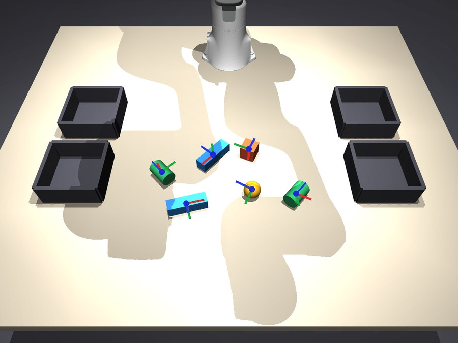
  <br><sub>Estimated poses from the full pipeline. Each object gets its own axis triad from ICP.</sub>
</p>

| Metric | Value |
|---|---|
| Sort accuracy (50 unseen scenes, 272 objects) | 100% |
| Mean pose error (ADD-S, 1,624 objects) | 1.3 mm |
| Pick success without orientation estimation | 72.5% |
| Detector mask mAP50 / mAP50-95 | 0.995 / 0.780 |
| Hand-labelled training images | 0 |

> The source code is not in this repository. This repo documents the project, its results and how the pieces work. Get in touch if you want to see the code.

## Contents

- [Image analysis pipeline](#image-analysis-pipeline)
- [Training strategy](#training-strategy)
- [Pose estimation with ICP](#pose-estimation-with-icp)
- [Grasping and control](#grasping-and-control)
- [Results](#results)
- [Things that broke](#things-that-broke)
- [Limitations](#limitations)
- [Running it](#running-it)

## Image analysis pipeline

Every pick starts with a fresh image. The robot looks, picks one object, drops it in a bin and looks again, so the scene is re-analysed after each move.

| # | Step | What happens | Output |
|:-:|---|---|:-:|
| 1 | Capture | The scene camera renders a 640×480 RGB image and a metric depth map. Intrinsics and the camera pose are known from calibration. | 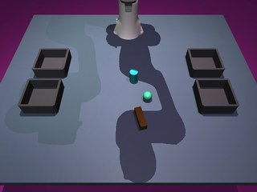 |
| 2 | Segment | YOLO11n-seg runs on the RGB image (confidence 0.5, full-resolution masks). One mask per object instance, in about 2 ms on the GPU. | 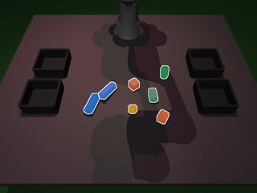 |
| 3 | Classify | Each mask comes with a class label (cube, bar, cylinder, sphere) and a confidence. The class decides which bin the object goes to and which 3D model ICP uses. | 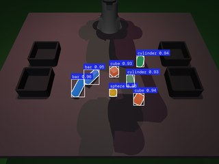 |
| 4 | Lift to 3D | Each mask is eroded by one pixel to drop the noisy edge pixels. The remaining pixels are back-projected through the depth map into a world-frame point cloud. | 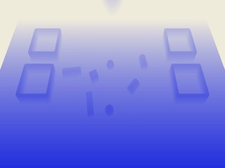 |
| 5 | Estimate pose | The object's CAD model is fitted to its point cloud with multi-hypothesis ICP. The result is a full rotation and translation for every object. |  |
| 6 | Choose a grasp | Grasp candidates come from the pose. Each one is checked for finger collisions against the rest of the depth cloud, and the cleanest grasp in the scene wins. | 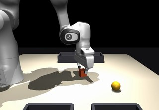 |
| 7 | Execute | IK turns the grasp into joint targets. The arm picks, carries the object to its bin and returns home. Objects already inside a bin are ignored on the next look. | 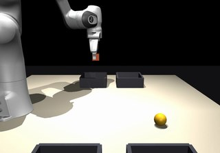 |

<p align="center">
  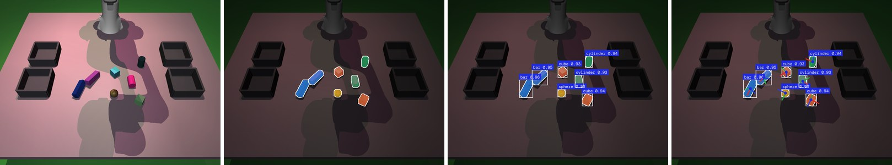
  <br><sub>The same frame at each stage: raw render, instance masks, labelled detections, estimated poses.</sub>
</p>

The back-projection in step 4 is a plain pinhole model. Depth comes straight from the renderer, so there is no extra noise model:

```python
def backproject(depth, mask, K, R, t):
    v, u = np.nonzero(mask)
    z = depth[v, u]
    x = (u + 0.5 - K[0, 2]) * z / K[0, 0]
    y = (v + 0.5 - K[1, 2]) * z / K[1, 1]
    return np.column_stack([x, y, z]) @ R.T + t   # camera frame -> world frame
```

## Training strategy

Nothing was labelled by hand. MuJoCo can render a segmentation image where every pixel holds the ID of the geometry it belongs to, so each training image comes with perfect instance masks for free. The same pass also gives depth and the true 6-DoF pose of every object, which is what the pose evaluation is scored against.

<p align="center">
  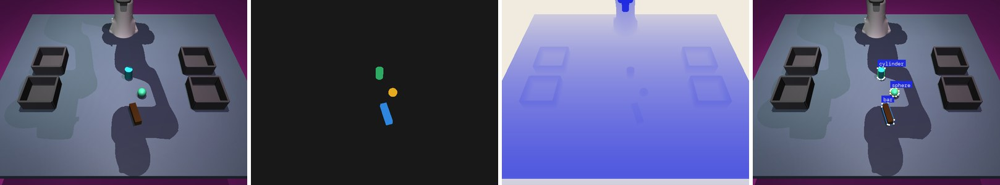
  <br><sub>One generated sample: RGB, simulator segmentation, depth, and the YOLO polygon labels derived from it.</sub>
</p>

Each frame is a new random scene. Between 3 and 8 objects are dropped onto the table with random orientations, and the physics settles them before the camera fires. That gives natural contact, stacking and occlusion instead of objects floating in a grid.

Appearance is randomized every frame so the detector learns shape rather than colour:

```python
for o in self.objects:
    m.geom_rgba[o.geom_id, :3] = r.uniform(0.05, 1.0, 3)       # object colour
m.geom_rgba[m.geom("table").id, :3] = r.uniform(0.2, 0.8, 3)    # table colour
m.geom_rgba[m.geom("floor").id, :3] = r.uniform(0.1, 0.6, 3)
m.light_pos[:] = self._light_pos0 + r.uniform(-0.4, 0.4, self._light_pos0.shape)
m.light_diffuse[0] = r.uniform(0.4, 1.0, 3)                     # key light
m.light_diffuse[1] = r.uniform(0.1, 0.5, 3)                     # fill light
if camera_jitter:                                               # ±8 cm position, ±5 cm aim point
    pos = CAM_POS + r.uniform(-0.08, 0.08, 3)
    target = CAM_TARGET + r.uniform(-0.05, 0.05, 3)
```

<p align="center">
  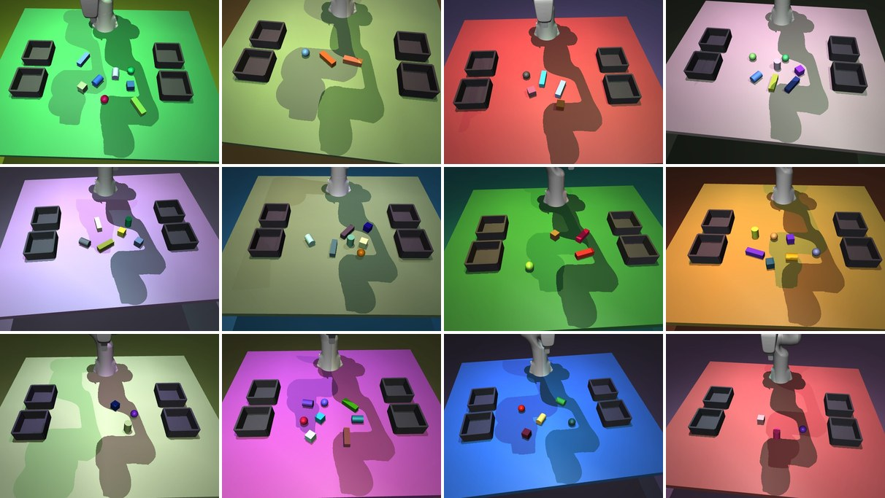
  <br><sub>Twelve training frames. Colours, lighting and camera pose change every time.</sub>
</p>

| Setting | Value |
|---|---|
| Dataset | 3,000 train / 400 val / 300 test frames, about 20,000 object outlines in total |
| Label format | Simulator mask → largest contour → `cv2.approxPolyDP` (1 px) → normalized YOLO polygon |
| Minimum object size | 40 visible pixels. Smaller slivers are left unlabelled |
| Test split | Fixed deployment camera with no jitter, so the test set matches what the robot sees |
| Model | YOLO11n-seg, COCO-pretrained, fine-tuned end to end |
| Schedule | 40 epochs, batch 16, 640 px, AMP, mosaic turned off for the last 10 epochs, early stopping after 15 flat epochs |
| Training time | 14.8 minutes on an RTX 4070 Super |

<p align="center">
  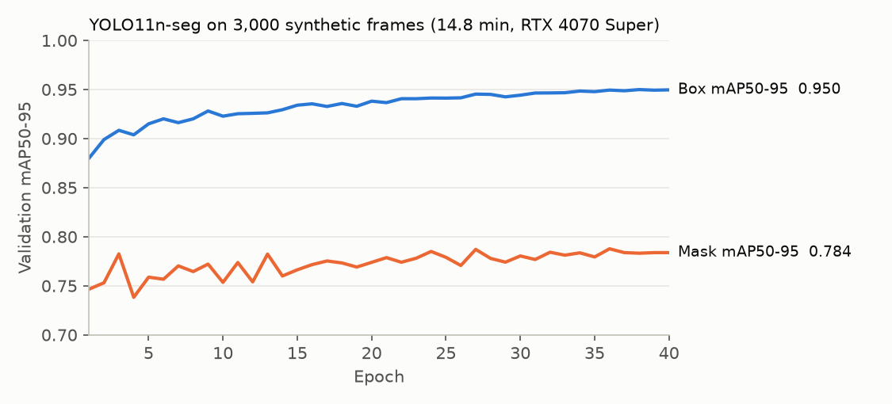
</p>

Box mAP keeps creeping up for all 40 epochs. Mask mAP50-95 flattens around 0.78 after a few epochs, mostly because the strict IoU thresholds punish a one-pixel boundary error on small objects. That boundary error doesn't matter downstream, since step 4 erodes the mask anyway and ICP only needs most of the points to be on the object.

To see how quickly the model picks this up, I re-ran training with checkpoints saved at fixed steps and ran each one on the same held-out frame:

<p align="center">
  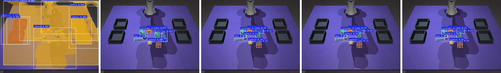
  <br><sub>Step 1, step 120, step 160, end of epoch 1, epoch 40. Mean confidence goes 0.00 → 0.08 → 0.57 → 0.84 → 0.93.</sub>
</p>

The pretrained model starts by calling half the table a sphere. By the end of the first epoch (188 steps) it finds all 8 objects and labels them correctly.

## Pose estimation with ICP

The sorting itself only needs the class. Grasping needs more than that. A bar is 10 cm long and the gripper opens to 8 cm, so the fingers have to close across its short side, and a lying cylinder can only be held across its diameter. Both of those depend on orientation, which the mask alone doesn't give you.

The estimator fits the known object model to the observed points with point-to-point ICP. Plain ICP from one starting guess gets stuck a lot here. The camera only sees one or two faces of each object, and a box seen from one side fits about equally well upside down. So the estimator runs many starts and keeps the one that explains the depth image best.

<p align="center">
  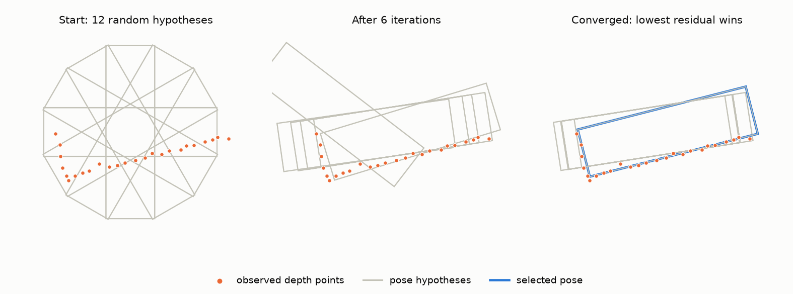
  <br><sub>A 2D illustration of the multi-hypothesis search. Several starts converge, the best-scoring one is kept.</sub>
</p>

How it works:

1. The centroid of the observed points sits on the visible surface, not at the object's centre, so the starting position is pushed away from the camera by a quarter of the object's diameter.
2. A coarse pass tries 48 random rotations with 8 ICP iterations each, on 150 observed points and a 400-point model. It's cheap and good enough to sort promising starts from hopeless ones.
3. The 6 lowest-residual candidates get 30 more iterations on the full 400-point observation.
4. On every iteration, model points whose normal faces away from the camera are dropped. The camera can't see the back of a cube, so the back shouldn't be matched to anything.
5. Correspondences further than 3× the median distance (minimum 5 mm) are ignored as outliers.
6. The winner is picked by residual plus a free-space penalty. A pose that puts model surface in front of what the camera saw, or on pixels that belong to another object, is wrong however well it fits the points.

The core loop:

```python
for _ in range(iters):
    pw, nw = pts @ R.T + t, nrm @ R.T
    vis = np.einsum("ij,ij->i", nw, cam_pos - pw) > 0      # model points facing the camera
    d, idx = cKDTree(pw[vis]).query(obs)
    keep = d < max(np.median(d) * 3, 0.005)                 # reject outlier matches
    dR, dt = kabsch(pw[vis][idx[keep]], obs[keep])          # best rigid fit (SVD)
    R, t = dR @ R, dR @ t + dt
```

And the free-space check that breaks ties between poses with equal residuals:

```python
uv, z = project(visible_model_points, K, Rc, tc)
in_front = z < depth[v, u] - 0.008                                   # space the camera saw as empty
off_mask = ~mask[v, u] & (np.abs(z - depth[v, u]) < 0.008)          # surface that belongs to something else
score = residual + 0.02 * (in_front | off_mask).mean()
```

All of this is NumPy and SciPy on the CPU, about 146 ms per object.

Pose accuracy on the 300 test scenes (1,624 objects). ADD-S is the mean closest-point distance between the model at the true pose and at the estimated pose, which handles symmetric objects correctly. "< 0.1d" means the error is under 10% of the object's diameter, the usual LINEMOD/BOP threshold.

| Masks | Pose method | Mean ADD-S | ADD-S < 1 cm | ADD-S < 0.1d | Median translation error | Time per object |
|---|---|---|---|---|---|---|
| Ground truth | Centroid only | 8.8 mm | 83.3% | 29.5% | 14.5 mm | 0.5 ms |
| Ground truth | ICP | 1.3 mm | 100.0% | 99.8% | 0.8 mm | 147 ms |
| YOLO | Centroid only | 8.2 mm | 83.6% | 38.1% | 12.4 mm | 0.5 ms |
| YOLO | ICP | **1.3 mm** | **99.9%** | **99.8%** | **0.8 mm** | 146 ms |

YOLO masks give the same pose accuracy as perfect masks, so the detector isn't the limiting factor. Per class with YOLO + ICP: cube 1.29 mm, bar 1.46 mm, cylinder 1.36 mm, sphere 1.00 mm.

## Grasping and control

Each pose turns into a short list of top-down grasp candidates, one per object axis that fits inside the gripper:

```python
if sphere or upright_cylinder:
    axes = [(dir(angle), 2 * radius) for angle in (90, 0, 45, 135)]
elif lying_cylinder:
    axes = [(cross(axis, z_up), 2 * radius), (axis, length)]   # across first, then along
else:  # boxes: narrowest horizontal axis first
    axes = [(R[:, i], 2 * ext[i]) for i in np.argsort(ext) if np.linalg.norm(R[:2, i]) > 0.7]
grasps = [(pos, yaw_of(g), w) for g, w in axes if w <= MAX_GRASP_WIDTH]
```

Before committing, every candidate is checked against the depth cloud of everything else in the scene. The check counts points inside the volume the open fingers sweep through on the way down. The planner then picks the (object, grasp) pair with the fewest hits, preferring objects at spots where a grasp hasn't failed before, then higher detector confidence, then whatever sits on top of a pile.

<p align="center">
  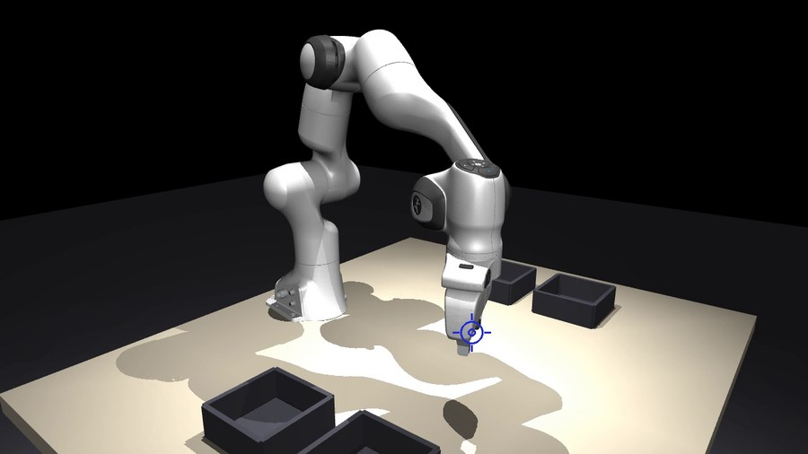
</p>

Motion uses damped least squares IK on the 7 arm joints, with a null-space term that pulls toward the home posture so the elbow doesn't wander:

```python
J = np.vstack([jacp, jacr])[:, :7]
dq = J.T @ np.linalg.solve(J @ J.T + damping * np.eye(6), err)
N = np.eye(7) - np.linalg.pinv(J) @ J
dq += N @ (0.05 * (q_home - q))                     # null-space pull toward home
q = np.clip(q + dq, q_lo, q_hi)
```

Each pick goes through pre-grasp (12 cm above), grasp, close, lift, carry to the bin, open, home. Joint targets are interpolated with a smoothstep and sent to the Panda's position actuators. The gripper holds the object through contact friction alone, with no welding or attaching, so a weak grasp drops the object.

## Results

<p align="center">
  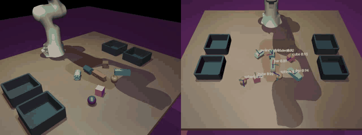
</p>

Closed-loop sorting on 50 random scenes the detector never saw (272 objects, 3 to 8 per scene):

| Pose source | Pick success | Sort accuracy | Scenes fully cleared | Attempts per object |
|---|---|---|---|---|
| Simulator ground truth (upper bound) | 100.0% | 100.0% | 100% | 1.00 |
| YOLO + centroid, no orientation | 72.5% | 92.3% | 62% | 1.27 |
| **YOLO + ICP** | **100.0%** | **100.0%** | **100%** | **1.00** |

The full system matches the ground-truth baseline. Taking orientation away drops per-attempt success to 72.5%, and the failures are almost all bars and lying cylinders grabbed along the wrong axis:

| Centroid only: the gripper closes along the bar and misses | ICP pose: the gripper turns 90° and lifts it |
|:-:|:-:|
| 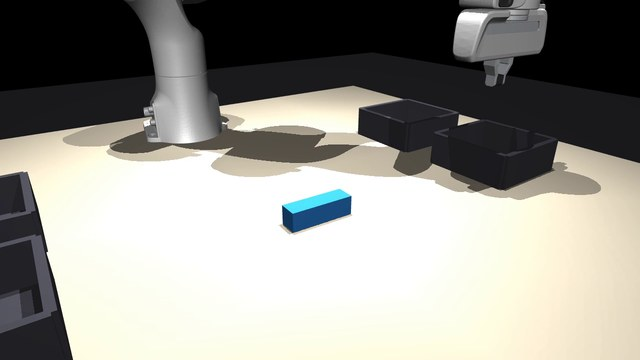 | 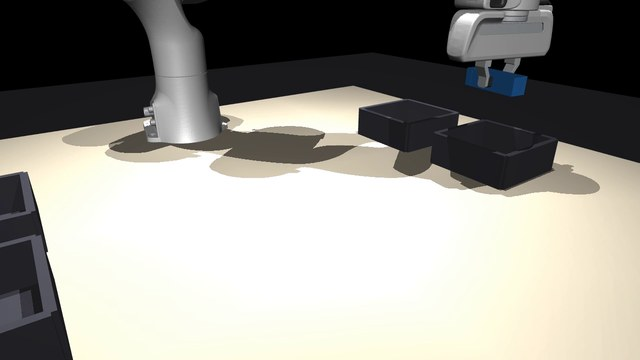 |

Timing: perception takes about 0.6 s per frame (2 ms for YOLO, the rest is ICP on the CPU), and one pick-and-place cycle takes 5.5 s of simulated time.

## Things that broke

### Cylinders that wouldn't stop rolling

Lying cylinders kept drifting for seconds after they looked settled. With `condim=4` MuJoCo has no rolling friction, so nothing stopped them. By the time the gripper arrived the object had moved a centimetre or more from its estimated pose. Switching to `condim=6` with a small rolling friction term fixed it, and ground-truth pick success went from 89% to 100%.

### Fingers landing on the neighbours

Objects lying side by side, or right next to a bin wall, left no room for an open finger. The first version just tried the preferred grasp and failed. The fix was the finger-sweep check against the depth cloud plus a memory of failed grasp locations, so the planner tries something else instead of repeating the same mistake.

| Before: going for the blue bar, one finger comes down on the purple one | After: the planner takes the purple bar first, from the end that has room |
|:-:|:-:|
| 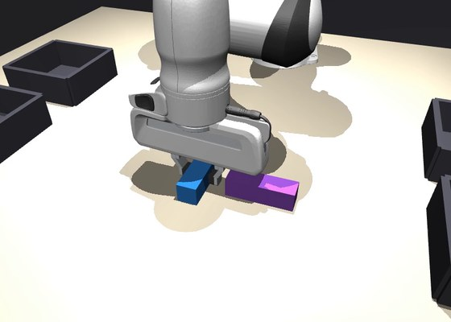 | 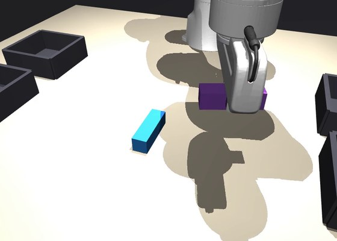 |

### Upside-down boxes

Single-start ICP kept converging to flipped poses on boxes, because from one viewpoint they fit almost as well. The 48 starts, coarse-to-fine schedule and free-space penalty described above came out of this.

## Limitations

- It's sim-to-sim. The detector trains and tests on the same renderer, with appearance and camera randomization as the only gap. Real cameras add depth noise, holes and reflections that aren't modelled here.
- The objects are four known primitives with exact CAD models. This is instance-level pose estimation, not category-level, and it won't generalize to unseen shapes.
- ICP is single-threaded NumPy. Batching the hypotheses on the GPU would cut perception time a lot.
- Grasps are top-down only, which is fine for a tabletop but rules out side grasps on tall objects.

## Running it

For reference, this is how the full pipeline runs from a clean checkout:

```bash
pip install torch torchvision --index-url https://download.pytorch.org/whl/cu126
pip install -r requirements.txt && pip install -e .
git clone --depth 1 --filter=blob:none --sparse https://github.com/google-deepmind/mujoco_menagerie third_party/mujoco_menagerie
git -C third_party/mujoco_menagerie sparse-checkout set franka_emika_panda

python scripts/generate_dataset.py                      # 3,700 frames, ~10 min
python scripts/train_detector.py                        # YOLO11n-seg, 40 epochs
python scripts/eval_pose.py                             # pose accuracy table
python scripts/run_pick_place.py --mode yolo_icp --video results/demo.mp4
```

```
pickplace/
  scene.py          scene built with MjSpec, domain randomization, RGB-D + segmentation rendering
  perception.py     YOLO wrapper, back-projection, multi-hypothesis ICP, ADD-S metric
  control.py        grasp candidates, finger collision check, DLS IK, trajectory execution
scripts/
  generate_dataset.py    synthetic data with automatic labels
  train_detector.py      fine-tuning and test-split metrics
  eval_pose.py           pose ablations (oracle/YOLO masks × centroid/ICP)
  run_pick_place.py      closed-loop sorting and ablations
```

Stack: MuJoCo 3.2+, Python, NumPy, SciPy, OpenCV, PyTorch, Ultralytics.

## Acknowledgements

- The Franka Panda model comes from [MuJoCo Menagerie](https://github.com/google-deepmind/mujoco_menagerie).
- Detection uses [Ultralytics YOLO11](https://github.com/ultralytics/ultralytics).
